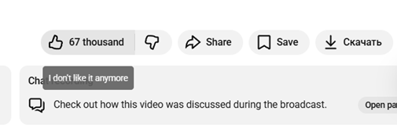

Bug ID: B1

Title: У інтерфейсі YouTube опис елементу елемент «Like it»  не відповідає реальному значенню. 

Severity: Trivial

Priority: Medium

Type: UI / Visual

Reproducibility: Always  

Середовище

URL: https://www.youtube.com/watch?v=hbe3CQamF8k&list=RDhbe3CQamF8k&start_radio=1

Browser: Chrome148.0.7778.179  (64 bit)

OS: win 11 - 25H2

Screen resolution:  1920×1080

Build / Version: 

Test account: xxx@gmail.com

Передумови:
В обліковий запис gmail увійдено.
Довільне відео увімкнено
Переглядач відкрито на повний екран

Кроки відтворення:
Навести курсор на елемент «Like it»

Expected:
Фоновий елемент, що показує стан hover однаковий для «Like it» та «Don’t like it»

Actual:
Фоновий елемент, що показує стан hover відрізняється для «Like it» та «Don’t like it»

Workaround: -
Related bugs: -

Вкладення:

Status:
Reported by: Tymur Komisar
Date reported:
Assigned to: Some One Petrenko
