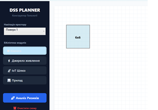

Тест кейс 1
Author:
Created:
Last Updated:
Version:

Priority: Високий 

Severity: Critical 

Test Type: Smoke, Positive 

Test Level: Unit test

Test Design Technique: EP

Automated: Ні
Linked Requirement: Some Req Nxxx

Description:
Перевірка розташування кімнати з валідними значеннями

Preconditions:
1. Вхід в застосунок здійснено
2. Відкрито конструктор побудови топологій

Test Data:
Розміри кімнати 6 на 6 одиниць

Steps:
1.	Натиснути кнопку «Кімната».
2.	В робочій зоні застосунку натиснути та тягнути, доки не буде досягнуто розміру кімнати 6 на 6 одиниць. 

Expected Result:
Кімнату розташовано та збережено на полотні.
Помилки відсутні.

Actual Result:
Кімнату розташовано та збережено на полотні.
Помилки відсутні.

Status:  
Пройдено 

Тест кейс 2
Author:
Created:
Last Updated:
Version:
Priority: Високий
Severity: Critical
Test Type: Boundary
Test Level: Unit test
Test Design Technique: BVA
Automated: Ні
Linked Requirement: Some Req Nxxx
Description:
Перевірка на коректність процесу розташування кімнати поряд з існуючою.

Preconditions:
Вхід в застосунок здійснено
Відкрито конструктор побудови топологій
На полотні створено кімнату 6х6 одиниць

Test Data:
Створена кімната – 6х6 одиниць
Нова кімната – 4х3 одиниці
Розташування нової кімнати – максимально близьке до існуючої, але не дотикаючись

Steps:
1.	Натиснути кнопку «Кімната».
2.	В робочій зоні застосунку, максимально близьке до існуючої, але не дотикаючись - натиснути та тягнути в сторону від існуючої кімнати, доки не буде досягнуто розміру кімнати 4х3 одиниць. 

Expected Result:
Кімнату розташовано та збережено на полотні.
Кімнату валідовано програмою, як коректно розташовану.
Помилки відсутні.

Actual Result:
Кімнату розташовано та збережено на полотні.
Кімнату валідовано програмою, як коректно розташовану.
Помилки відсутні.

Status: пройдено
 

Тест кейс 3
Author:
Created:
Last Updated:
Version:
Priority: Високий
Severity: Critical
Test Type: Smoke, Negative
Test Level: Unit test
Test Design Technique: EP
Automated: Ні
Linked Requirement: Some Req Nxxx
Description:
Перевірка програми на здатність визначати некоректне розташування кімнати.

Preconditions:
Вхід в застосунок здійснено
Відкрито конструктор побудови топологій
На полотні створено кімнату 6х6 одиниць
Поряд з існуючою кімнатою створено валідну кімнату розміром 4х3

Test Data:
Створені кімнати – 6х6 одиниць, 4х3 одиниці
Розташування існуючих кімнат– максимально близьке, але не дотикаються
Максимальна дальність коректного розташування кімнат – 3 міліметри одна від одної

Steps:
1.	Затиснути кімнату розміром 6х6.
2.	Рухати кімнату 6х6 в сторону від кімнати 4х3 на 5 міліметрів

Expected Result:
Кімнату розташовано та збережено на полотні.
Кімнати валідовано програмою, як не коректно розташовані.
Кімнати підсвічено червоним кольором.
Помилки відсутні.

Actual Result:
Кімнату розташовано та збережено на полотні.
Кімнати валідовано програмою, як не коректно розташовані.
Кімнати підсвічено червоним кольором.
Помилки відсутні.
Status: пройдено
 
Тест кейс 4
Author:
Created:
Last Updated:
Version:
Priority: Low
Severity: Minor
Test Type: Usability,
Test Level: Unit test
Test Design Technique: Error Guessing
Automated: Так
Linked Requirement: Some Req Nxxx
Description:
Перевірка зручності видалення великої кількості приладів

Preconditions:
На робочому полотні розташовано велику кількість приладів

Test Data:
Кількість розташованих приладів – 12: 3 сервери, 3 робочі станції, 3 елемента освітлення, 3 кавоварки

Steps:
1.	Затиснути праву клавішу миші та покрити зоною вибору 8 приладів (3 сервери, 3 робочі станції, 2 кавоварки).
2.	Натиснути на кошик для видалення.

Expected Result:
Прилади було виділено, візуально зрозумілим чином.
Після натискання кошику, виділені прилади було видалено.

Actual Result:    
Status:  
Прилади не було виділено
Видалення не відбулося.

Status: провалено

Тест кейс 5
Author:
Created:
Last Updated:
Version:
Priority: Середній
Severity: Major
Test Type: Smoke, Boundary
Test Level: Unit test
Test Design Technique: Причина - наслідок
Automated: Ні
Linked Requirement: Some Req Nxxx
Description:
Перевірка на коректність процесу перемикання між поверхами топології.

Preconditions:
Вхід в застосунок здійснено
Відкрито конструктор побудови топологій
На полотні створено дві кімнати, що дотикаються одна до одної (розмір кімнат - 6х6 та 6х4).

Test Data:
Обрано поверх 2
Створена кімната – 6х6 одиниць
Нова кімната – 6х4 одиниці
Розташування кімнат – дотикаються одна до одної

Steps:
1.	Натиснути на меню «Навігація простору»
2.	Натиснути «Поверх 1»

Expected Result:
Поверх 2 приховано з робочого полотна.
Поверх 1 відображено на робочому полотні.
Робоче полотно виглядає пустим.

Actual Result:
Поверх 2 приховано з робочого полотна.
Поверх 1 відображено на робочому полотні.
Робоче полотно виглядає пустим.
Status: пройдено

 

Тест кейс 6
Author:
Created:
Last Updated:
Version:
Priority: Високий
Severity: Critical
Test Type: Functional, Boundary
Test Level: Unit test
Test Design Technique: BVA
Automated: Ні
Linked Requirement: Some Req Nxxx
Description:
Перевірка на коректність обробки некоректного значення критичності.

Preconditions:
Вхід в застосунок здійснено
Відкрито конструктор побудови топологій
На полотні створено кімнату та розміщено робочу станцію

Test Data:
Створена кімната – 8х7 одиниць
В межах кімнати розміщено прилад – робоча станція
Показник критичності для робочої станції - 5

Steps:
1.	Натиснути на робочу станцію
2.	Натиснути на поле «Критичність»
3.	Ввести рівень критичності 11

Expected Result:
Рівень критичності не оновлено
Показано повідомлення про вихід за рамки коректного проміжку значень критичності.

Actual Result:
Рівень критичності оновлено.
Ніякого повідомлення системою не показано.
Status: провалено
 

Тест кейс 7
Author:
Created:
Last Updated:
Version:
Priority: Medium 
Severity: Major
Test Type: Functional, Positive
Test Level: Unit
Test Design Technique: Use Case Testing
Automated: Так 
Linked Requirement: Some Req Nxxx
Description: Перевірка коректності визначення найближчого ІоТ хабу.

Preconditions:
Вхід в застосунок здійснено
Відкрито конструктор побудови топологій
На полотні створено 3 кімнати та розміщено робочі станції, хаб
Сигнал між станціями та хабом встановлено

Test Data:
3 кімнати  – 8х7, 7х6, 7х12 одиниць.
Розташування кімнат – друга під першою, третя правіше. Усі кімнати розташовано впритул і вони утворюють форму наближену до квадрату
В межах кімнат розміщено прилади – 4 робочі станції вздовж лівого краю першої, 4 робочі станції вздовж лівого краю другої і хаб у правому верхньому кутку третьої кімнати

Steps:
1.	Обрати ІоТ шлюз на панелі зліва
2.	Розташувати ІоТ шлюз у правому нижньому кутку третьої кімнати

Expected Result:
Силу сигналу пристроїв перераховано з урахуванням нового пристрою.
Чотири нижні робочі станції від’єдналися від початкового шлюзу та приєдналися до нового.

Actual Result: 
Силу сигналу пристроїв перераховано з урахуванням нового пристрою.
Чотири нижні робочі станції від’єдналися від початкового шлюзу та приєдналися до нового.

Status:  пройдено
 
Тест кейс 8 

Author:
Created:
Last Updated:
Version:
Priority: Високий
Severity: Critical
Test Type: Negative
Test Level: Unit test
Test Design Technique: Попереднє вгадування помилки
Automated: Ні
Linked Requirement: Some Req Nxxx
Description:
Перевірка розміщення двох розділених між собою груп кімнат, як не коректне.

Preconditions:
Вхід в застосунок здійснено
Відкрито конструктор побудови топологій
На полотні розташовано набір кімнат

Test Data:
Розташування кімнат – в два ряди 
Кількість кімнат в першому ряді: 2
Кількість кімнат в другому ряді: 3
Розміри кімнат з ліва на право: 7х3, 4х3 (в першому ряду), 2х2, 5х5, 9х6(в другому ряду)

Steps:
1.	Перетягуванням відділити угрупування кімнату 7х3 вгору на один сантиметр
2.	Перетягуванням відділити угрупування кімнату 4х3 вгору на один сантиметр так, щоб вона дотикалася до кімнати, розміром 7х3

Expected Result:
Кімнати розташовано та збережено на полотні.
Розташування кімнат визначено, як не коректне
Усі кімнати підсвічено червоним кольором

Actual Result:
Кімнати розташовано та збережено на полотні.
Розташування кімнат визначено, як коректне
Усі кімнати підсвічено синім кольором
Status: провалено
